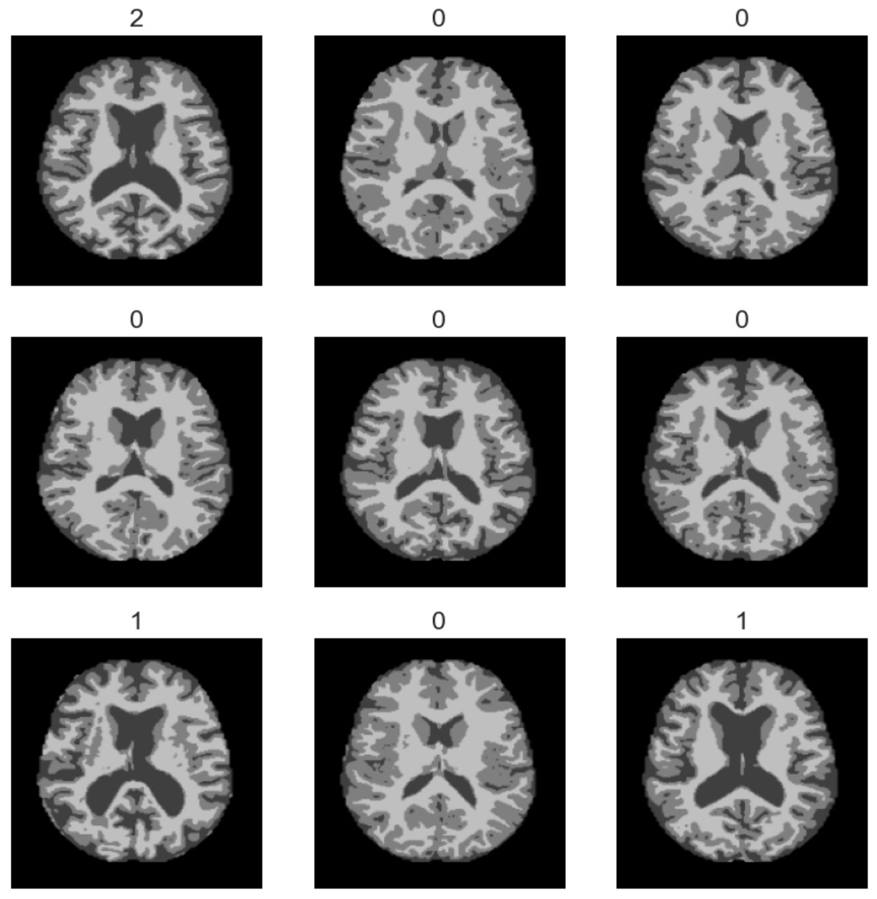

# Neural-Network-for-Image-Classification-Dementia-MRIs

This is an extension of my graduate capstone project. The initial project achieved about 78% validation accuracy on the OASIS-1 dataset. This is a small dataset with 436 images.

I tried the same Convolutional Neural Network model on a larger Kaggle dataset with thousands of brain MRI images, and the model achieved 98.67% accuracy on the validation data!
